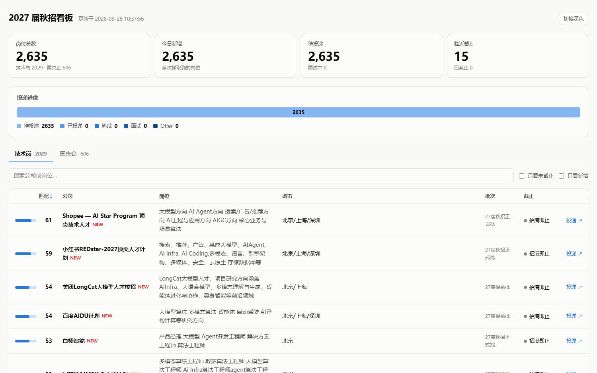

# job-hunt-pipeline

我秋招期间写的一套求职流水线：岗位聚合、匹配打分、简历定制、投递追踪、面试复盘。

它整个跑在你自己的电脑上 —— 零付费、零爬虫、数据不出本机。

> 面向中国校招场景，技术岗和国央企分成两条互不干扰的通道。
> 每天自动拉取 2600+ 岗位、按你可配置的权重打分排序，
> 按方向变体生成单页简历，还带一个网申填表书签和一套会随面试次数长大的题库。
>
> An offline-first job-hunting pipeline for Chinese campus recruiting.
> No paid APIs, no scraping of job platforms, no data leaving your machine.

---

## 我为什么做这个

秋招最耗时的不是面试，是**信息处理**。

我当时每天要花一两个小时刷各种招聘网站，还差点漏掉一个国央企的报名截止日期 ——
那家的截止时间写在公告最底下，我是在投递窗口关闭前两天才看到的。
简历改到第三十份的时候我意识到，这件事该交给程序做。

| 我当时的问题 | 现在它怎么处理 |
|---|---|
| 每天花 1-2 小时刷招聘网站 | 每日定时抓取 2600+ 岗位，生成可筛选看板 |
| 差点漏掉国央企的报名截止日期 | 国央企独立通道，按截止日期排序并标红 |
| 每家都要改简历，改到崩溃 | 主简历 + 方向变体 + 按 JD 自动微调 |
| 网申表单反复填同样的字段 | 浏览器书签一键填充，跑在你自己的会话里 |
| 面试被追问细节答不上来 | 根据你的经历生成深挖题库和追问链 |
| 面完就忘，同样的坑反复踩 | 复盘回流，题库随面试次数累积 |



---

## 四条我坚持的设计

功能谁都能加，但这四条是我纠结过之后刻意定下来的。我觉得它们比功能本身更值钱。

### 一、我不爬招聘平台

自己写 Playwright 去爬 Boss直聘、牛客网，意味着**随时可能被封号，而且要一直维护** ——
页面结构一改，脚本就废了。为了省每天一小时，搭进去一个长期负担，不划算。

社区里已经有人维护高质量的校招聚合数据，每日更新。读它们是零风险、零成本的。
所以这套工具只读公开的 GitHub 原始文件和公开招聘 API。

### 二、我不让 AI 编造简历内容

用 AI 改简历最容易出的事，是它顺手补一个"看起来很合理"的数字。

所以我做了个约束：简历内容**只能来自 `data/resume/facts.yaml`**，
生成脚本只允许「选择、排序、改写措辞」，不允许引入任何新事实。
你把事实写全，剩下的交给它排列组合。

配套的 `--jd` 模式会告诉你还差什么：

```
已覆盖（13）：大模型、LLM、Agent、智能体、RAG、检索增强、微调、LoRA...
缺口（1）：向量数据库
```

它不会替你编一个"向量数据库经验"上去。看到缺口，你要么承认，要么去补真的。

### 三、自动化止步于「提交」

填表书签会帮你填好所有能识别的字段，**但它不会点任何按钮**。

这不是做不到，是我不想让它做。让 AI 替你提交网申，风险远大于省下的那几秒 ——
投错岗位、重复投递、信息填歪，出了事都是你自己的账号承担。

### 四、技术岗和国央企分成两条线

这两类岗位的招聘节奏、评价标准、信息渠道完全不同。混在一起排序的话，
国央企岗位会被互联网岗位淹没 —— 我一开始就是这么干的，结果清单一拉出来
全是互联网大厂，国央企全在两百名开外。

现在它们是不同的源、不同的表、不同的报告分区。

---

## 怎么用

**环境**：Python 3.10+，Windows / macOS / Linux
（核心功能只用标准库 + `pyyaml`；导出 PDF 需要 Edge 或 Chrome，没有也能用）

```bash
git clone https://github.com/cresh0011/job-hunt-pipeline.git
cd job-hunt-pipeline

pip install pyyaml            # 唯一必需的三方库
cp data/resume/facts.example.yaml data/resume/facts.yaml
# 打开 facts.yaml，把里面那个虚构的"张明"换成你

python scripts/run_daily.py   # 抓取 + 打分 + 生成看板
```

然后打开 `dashboard.html`。

### 装填表书签

```bash
python scripts/build_autofill.py
```

浏览器打开 `apply/bookmarklet.html`，把那个按钮拖到书签栏。
以后在任意网申页面点一下，基础字段就填好了。

### 生成简历

```bash
python scripts/build_resume.py --list                     # 看看有哪些变体
python scripts/build_resume.py --all --pdf                # 全部生成
python scripts/build_resume.py --jd jd.txt --company X    # 按 JD 定制
```

变体定义在 `resume/variants.yaml`，它只控制**怎么排**（章节顺序、技能顺序、项目详略），
内容全部来自 `facts.yaml`。

### 记录投递进度

```bash
python scripts/track.py 某公司 已投递
python scripts/track.py 某公司 一面 --note "问了 RAG 评测"
python scripts/track.py --stats
```

### 准备面试

```bash
python scripts/build_questions.py --company X --role Y
python scripts/build_questions.py --retro X          # 面完生成复盘模板
python scripts/build_questions.py --collect-retro    # 把实战题回流进题库
```

**最后这条命令是整套流程里最值钱的。** 每面完一场记一次，第三次面试的准备质量
会明显高于第一次 —— 因为题库里已经有你真实踩过的坑了。

---

## 各个脚本

| 脚本 | 作用 |
|---|---|
| `fetch_tech.py` | 技术岗：拉取社区聚合源 |
| `fetch_soe.py` | 国央企：国聘网 + 国家大学生就业服务平台 |
| `score.py` | 匹配打分，权重全在 `config.yaml` |
| `dashboard.py` | 生成单文件看板（离线、浅深色自适应） |
| `daily_list.py` | 把两千多条收敛成一份能照着做的短名单 |
| `build_resume.py` | 简历生成 + PDF 导出 + JD 缺口分析 |
| `build_autofill.py` | 生成网申填表书签 |
| `build_questions.py` | 面试题库 + 复盘回流 |
| `track.py` | 投递进度追踪 |
| `run_daily.py` | 串起全流程，供定时任务调用 |

### 让它每天自己跑

```bash
# Windows
schtasks /create /tn "JobHunt-Daily" /tr "D:\path\to\run_daily.bat" /sc DAILY /st 09:00 /f

# macOS / Linux
0 9 * * * cd /path/to/job-hunt-pipeline && python scripts/run_daily.py --quiet
```

> **用 Windows 的话，记得再加一步。** 任务计划默认"错过就跳过" ——
> 而你会关机睡觉，09:00 那次基本跑不上。加上这个设置它会在开机后补跑：
> ```powershell
> $t = Get-ScheduledTask -TaskName "JobHunt-Daily"
> $t.Settings.StartWhenAvailable = $true
> Set-ScheduledTask -TaskName "JobHunt-Daily" -Settings $t.Settings
> ```

### 想按待遇挑国央企

```bash
python scripts/daily_list.py --soe-pay
```

放宽专业要求、按薪资排序，并标出 JD 里能识别到的待遇信号（编制 / 落户 / 公积金 / 宿舍）。

> ⚠️ 这个视角**一定要自己逐个点进去看**。放宽专业匹配后会捞进一堆
> "专业范围写得宽、实际是传统工业岗"的职位 —— 值班员、检修工、电解工我都见过。

---

## 数据从哪来，以及我踩过的坑

| 源 | 说明 |
|---|---|
| [xiaozhao-radar](https://github.com/jiabaobei/xiaozhao-radar) | 技术岗主源，约 1600 条，带行业标签和投递链接 |
| [xixicc2027](https://github.com/xixicc186/xixicc2027) | 技术岗补充，结构最规整，带批次和截止日期 |
| [国聘网](https://www.iguopin.com/) | 国央企主源，带真实截止时间、完整 JD 和专业要求 |
| [国家大学生就业服务平台](https://ncss.cn/) | 薄补充，匿名访问每查询只给 20 条 |

下面这些是我调试时实测出来的，写在这里省得你再踩一遍：

- **国聘网是「推荐池」接口，不是稳定列表。** 分页会重叠（实测 page1 和 page2 有 5 条重复），
  每次返回的切片都不一样。所以我让它每天重跑、慢慢累积覆盖 ——
  如果你看到"这次新增 0 条"，那是正常的，不是坏了。
- **国聘的薪资字段严重偏低，别信。** 我一开始按它的数据判断"国央企待遇不行"，
  后来去查官方公告才发现错得离谱：某岗位挂网 8K，官方公告写的是 15-26K。
  **想知道真实待遇，必须去查公司自己的招聘公告。**
- **国家大学生就业服务平台说每查询上限 100 条，实测只有 20 条**，而且
  `offset` 参数完全无效。我没假装它能翻页，代码就按 20 条写的。
- **聚合源里有"一条记录打包一批不相关岗位"的情况。** 只要里面一两个词命中关键词，
  整条就得高分。所以我经常看到"高分子材料研究员"排在 AI 岗位前面 ——
  **高分不等于对口，一定要点进 JD 看。**
- **`.bat` 文件必须纯 ASCII + CRLF。** 我用 UTF-8 写了中文注释，
  cmd.exe 按 GBK 去读，把注释当命令执行，脚本静默失败、一句报错都没有。
  我查了半天才发现。

---

## 我评估过但没做的方案

这部分可能比上面更有参考价值 —— 它们说明为什么最后长成现在这样。

**为什么不用现成的 MCP Server？**
我调研了一圈，市面上的求职类 MCP 全部面向 LinkedIn、俄罗斯 hh.ru、美国 Handshake，
对中国招聘市场没用。而我的岗位数据本来就是批量抓下来落库的，
Claude Code 直接跑脚本读 SQLite 就行，走 MCP 反而更绕、更费 token。

**为什么 PDF 用 Edge 而不是 Playwright？**
Windows 自带 Edge 就是 Chromium 内核，`--print-to-pdf` 的渲染质量和 Playwright 一样，
但省掉约 150MB 的浏览器下载。踩了两个坑：必须加 `--user-data-dir` 指向独立临时目录
（不然 Edge 检测到已有实例就转交任务然后立刻返回，什么都不打印）；
还有**进程退出不等于文件写完**，得轮询等它落盘。

**为什么填表只做书签，不做全自动投递？**
大厂网申系统（北森、MokaHR、大易、自建）的 DOM 结构一家一个样，
写死选择器的维护成本会很快超过收益。而书签跑在我自己的浏览器和登录态里，
不引入任何自动化指纹 —— 零封号风险。而且很多公司复用同一套 SaaS，
所以按**字段语义**匹配比按选择器硬编码覆盖率高得多。

---

## 目录结构

```
├── config.yaml              匹配权重、数据源、城市/学历/专业偏好（改这里，不用改代码）
├── CLAUDE.md                给我自己用的架构笔记，也留给 AI 助手看
├── run_daily.bat            一键跑全流程（Windows）
├── data/
│   ├── jobs.db              SQLite 主库（唯一真相源）
│   ├── raw/                 每日原始快照
│   └── resume/
│       ├── facts.yaml       事实库 ← 你的简历内容唯一来源
│       └── facts.example.yaml
├── resume/
│   ├── variants.yaml        方向变体
│   ├── templates/           Jinja2 简历模板
│   └── output/              生成的 HTML / PDF
├── apply/                   填表书签
├── interview/
│   ├── questions.yaml       题库内容
│   ├── question_bank/       按公司生成的题库
│   └── retro/               面试复盘
└── scripts/                 全部脚本
```

---

## ⚠️ 如果你要用它，先看这段

这个工具会在你本地生成含**真实姓名、手机、邮箱、学号、学校、完整简历**的文件。
我自己的仓库里 `.gitignore` 已经排除了这些路径，但你 fork 之后**请自己再确认一遍**：

```bash
git status --short
git diff --cached --stat
```

最容易出事的是这四个：

```
data/resume/facts.yaml      # 你的全部身份信息
resume/output/              # 生成的简历 PDF
apply/autofill.js           # 可直接在浏览器执行的完整个人信息
data/jobs.db                # 投递记录
```

**提交前扫一眼，比事后删除靠谱得多** —— 推上去的东西即使删了也可能已经被缓存或索引。

---

## License

MIT —— 随便用，改，分发。如果它帮你省下了几个小时，那我挺开心的。
